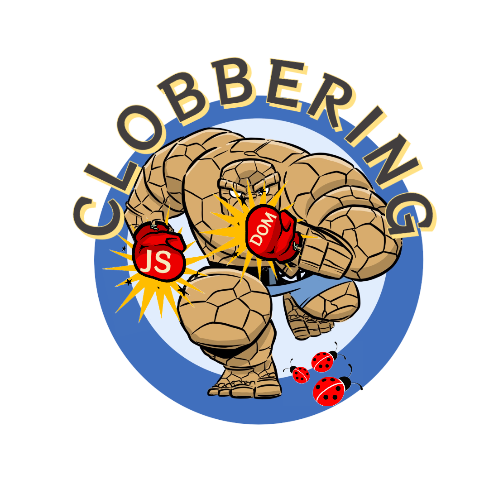

<p align="center">
	<a href="//soheilkhodayari.github.io/JAW/">
		
	</a>
</p>

<p align="center">
	<span><b> TheThing </b></span>
</p>

<p align="center">
	<a href="https://soheilkhodayari.github.io/DOMClobbering">Website</a> |
	<a href="https://github.com/SoheilKhodayari/TheThing/tree/master/docs">Docs</a> |
	<a href="https://github.com/SoheilKhodayari/TheThing/tree/master/docs/thething.md">Quick Start</a> |
	<a href="https://soheilkhodayari.github.io/DOMClobbering/domc_wiki">DOM Clobbering</a>
</p>


# TheThing


[](https://travis-ci.org/boennemann/badges) [](https://img.shields.io/badge/node%40latest-%3E%3D%206.0.0-brightgreen.svg) [](https://www.python.org/) [](https://github.com/Naereen/badges/) [](https://twitter.com/intent/tweet?text=Find%20DOM%20Clobbering%20vulnerabilities%20with%20TheThing&url=https://github.com/SoheilKhodayari/TheThing)


A static-dynamic security analysis tool for [DOM clobbering](https://portswigger.net/web-security/dom-based/dom-clobbering) vulnerabilities based on [JAW-v1](https://github.com/SoheilKhodayari/JAW/releases/tag/v1.1.5) and [Iroh](https://github.com/maierfelix/Iroh). TheThing can be used for analyzing the client-side of web applications.

**Note:** The source code of TheThing has been merged with [JAW](https://soheilkhodayari.github.io/JAW/), resulting in [JAW-v2](https://github.com/SoheilKhodayari/JAW/releases/tag/v2.0.1). Accordingly, this repository now uses [JAW-v2](https://github.com/SoheilKhodayari/JAW/releases/tag/v2.0.1) as a [git submodule](https://git-scm.com/book/en/v2/Git-Tools-Submodules).

This project is available as open source under the terms of the `GNU AFFERO GENERAL PUBLIC LICENSE V3.0`. See [LICENSE](LICENSE) for more information.

TheThing has a website available at [https://soheilkhodayari.github.io/DOMClobbering](https://soheilkhodayari.github.io/DOMClobbering). 


<details>
<summary>📓 <b>Content</b></summary>

## Table of Contents

- [DOM Clobbering](#-dom-clobbering)
	- [Techniques](https://github.com/SoheilKhodayari/TheThing/tree/master/docs/dom-clobbering/dom-clobbering.md)
- [Overview of TheThing](#-overview)
	- [Crawler](https://github.com/SoheilKhodayari/JAW/tree/master/crawler)
	- [Static Analysis](https://github.com/SoheilKhodayari/JAW/tree/master/analyses/domclobbering)
	- [Dynamic Analysis](https://github.com/SoheilKhodayari/JAW/tree/master/dynamic)
- [Installation](#-installation)
- [Running](#-running)
- [Further Documentation](#-documentation)
	- [Building Blocks](https://github.com/SoheilKhodayari/TheThing/tree/master/docs/thething.md)
	- [Crawling](https://github.com/SoheilKhodayari/TheThing/tree/master/docs/crawling/crawlers.md)
	- [Static Analysis](https://github.com/SoheilKhodayari/TheThing/tree/master/docs/thething.md#static-analyzer)
	- [Syntax Tree](https://github.com/SoheilKhodayari/TheThing/tree/master/docs/hpg/syntax-tree.md)
	- [Property Graph Nodes](https://github.com/SoheilKhodayari/TheThing/tree/master/docs/hpg/hpg-nodes.md)
	- [Property Edges](https://github.com/SoheilKhodayari/TheThing/tree/master/docs/hpg/hpg-edges.md)
	- [Property Graph Querying](https://github.com/SoheilKhodayari/TheThing/tree/master/docs/hpg/hpg-querying.md)
	- [Neo4j Docker](https://github.com/SoheilKhodayari/TheThing/tree/master/docs/thething/neo4j/neo4j-docker.md)
	- [Dynamic Analysis](https://github.com/SoheilKhodayari/TheThing/tree/master/docs/thething.md#dynamic-analyzer)
- [Contribution and Code of Conduct](#-contribution-and-code-of-conduct)
- [Academic Publication](#-academic-publication)

</details>


## ✨ What is DOM Clobbering? 


[DOM Clobbering](https://portswigger.net/web-security/dom-based/dom-clobbering) is an attack technique where the attacker achieves arbitrary client-side code execution by injecting a non-script HTML markup into a vulnerable webpage and transform the initially secure markup into executable code. 

DOM Clobbering originates from a naming collision between JavaScript variables and [named HTML markups](https://html.spec.whatwg.org/multipage/window-object.html#named-access-on-the-window-object), where attackers confuse the web application by injecting HTML elements whose `id` or `name` attribute matches the name of security-sensitive variables, such as variables used for fetching remote content (e.g., script `src`). 

For more information, See [here](https://soheilkhodayari.github.io/DOMClobbering/domc_wiki).


## ➰ Overview 

TheThing comprises three building block components: 

- **[Web Crawler](https://github.com/SoheilKhodayari/JAW/tree/master/crawler):** given a single seed URL of a webapp under test, collects its webpages' resources (e.g., scripts).
- **[Static Analyzer](https://github.com/SoheilKhodayari/JAW/tree/master/analyses/domclobbering):** detects DOM Clobbering sources and sinks and potential data flows among them.
- **[Dynamic Analyzer](https://github.com/SoheilKhodayari/JAW/tree/master/dynamic):** checks the clobberability of the identified sources, and the data flows. 


The architecture of the TheThing is shown below.

<p align="center">
  
</p>


## 🏭 Installation

The source code of TheThing has been merged with [JAW](https://soheilkhodayari.github.io/JAW/), resulting in [JAW-v2](https://github.com/SoheilKhodayari/JAW/releases/tag/v2.0.1). As such, this repository now uses [JAW-v2](https://github.com/SoheilKhodayari/JAW/releases/tag/v2.0.1) as a [git submodule](https://git-scm.com/book/en/v2/Git-Tools-Submodules).


To clone TheThing and its submodule `JAW-v2.x`, you can do:
```bash
$ git clone --recurse-submodules https://github.com/SoheilKhodayari/TheThing
```

Alternatively, do:
```bash
$ git clone https://github.com/SoheilKhodayari/TheThing
$ cd TheThing
$ git clone https://github.com/SoheilKhodayari/JAW --branch v2.0.4  
```

Then, copy the JAW's content into the root directory:
```bash
$ cp -rf ./JAW/* ./
```

Finally, get the necessary dependencies via:
```bash
$ ./install.sh
```

This will install the required `npm` and `python` libraries, and the `chromium` driver.


**Note:** You can also download the pre-packaged code from the [releases](https://github.com/SoheilKhodayari/TheThing/releases/tag/v1.0.0) section or the [stable](https://github.com/SoheilKhodayari/TheThing/tree/stable) branch.


## 🚀 Running


You can run an instance of the pipeline in a background screen via: 
```bash
$ screen -dmS s1 bash -c 'python3 -m run_domclobbering --conf=config.domclobbering.yaml; exec sh'
```

The CLI provides the following options:

```
$ python3 -m run_domclobbering -h

usage: run_domclobbering.py [-h] [--conf FILE] [--site SITE] [--list LIST] [--from FROM] [--to TO]

This script runs the tool pipeline.

optional arguments:
  -h, --help            show this help message and exit
  --conf FILE, -C FILE  pipeline configuration file. (default: config.domclobbering.yaml)
  --site SITE, -S SITE  website to test; overrides config file (default: None)
  --list LIST, -L LIST  site list to test; overrides config file (default: None)
  --from FROM, -F FROM  the first entry to consider when a site list is provided; overrides config file (default: -1)
  --to TO, -T TO        the last entry to consider when a site list is provided; overrides config file (default: -1)

```


**Configuration:** TheThing expects a `.yaml` config file as input. See [config.domclobbering.yaml](https://github.com/SoheilKhodayari/TheThing/blob/master/config.domclobbering.yaml) for an example.


**Running Building Blocks:** For documentation on how to run each building block of the tool individually, see [here](https://github.com/SoheilKhodayari/TheThing/tree/master/docs/thething.md). 


## 🙋 Questions

For any questions, suggestions, feedback or concerns, please [raise an issue in the repository](https://github.com/SoheilKhodayari/TheThing/issues). 


## 🎃 Contribution and Code Of Conduct

Bug reports and pull requests are more than welcomed on [GitHub](/pulls). For more information, please refer to [contribution guidelines](https://github.com/SoheilKhodayari/TheThing/blob/master/docs/contributions.md). 

This project is intended to be a safe, welcoming space, and contributors are expected to adhere to the contributor [code of conduct](https://github.com/SoheilKhodayari/TheThing/blob/master/CODE_OF_CONDUCT.md). 


## 📚 Documentation

Please refer to the complete documentation in [docs](https://github.com/SoheilKhodayari/TheThing/tree/master/docs).


## 📝 Academic Publication

If you use the TheThing for academic research, we encourage you to cite the following [paper](https://soheilkhodayari.github.io/papers/sp23_domclob.pdf):

```
@inproceedings {SKhodayariSP23TheThing,
  author = {Soheil Khodayari and Giancarlo Pellegrino},
  title = {It's (DOM) Clobbering Time: Attack Techniques, Prevalence, and Defenses,
  booktitle = {To Appear at proceedings of the 44th IEEE Symposium on Security and Privacy},
  year = {2023},
}
```


